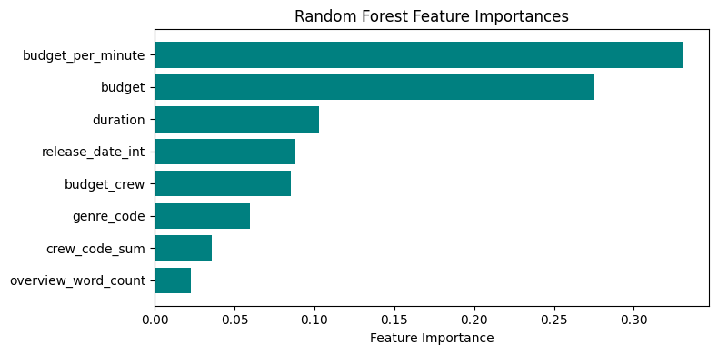

# Movie Revenue Prediction

## Project Description
Predicts revenue of a Movie an looks if it will be a hit or a flop. 

## Results
While the model is tends to show a perfect fit it still underperforms; incorporating different types of features from alternative data sources, as well as increasing the overall data volume, may help improve performance. However, with each new feature derived from a different dataset, the number of usable data points tends to drop due to incomplete or missing entries. Since most of the available data is textual and requires conversion into numerical form, and given that there are only 1064 usable data points with varying budgets and revenues, expanding and enriching the dataset could be crucial for achieving better model accuracy and generalization.

### Name & URL
| Name          | URL |
|--------------|----|
| Huggingface  | [Huggingface Space](https://huggingface.co/spaces/kabboabb/movie-hit-or-flop-prediction) |
| Code         | [GitHub Repository](https://github.com/kabboabb/abschlussarbeit-ki-anwendeung) |

## Data Sources and Features Used Per Source
| Data Source | Features |
|-------------|----------|
| [Kaggle IMDb Movies dataset from 2000 - 2020](https://www.kaggle.com/datasets/chenyanglim/imdb-v2) | duration |
| [Kaggle Movie Budgets And Revenues](https://www.stadt-zuerich.ch/geodaten/download/Statistische_Quartiere) | Relese Date, Movie Name, Budget, Domestic Gross, World Wide Gross |
| [Kaggle IMDB movies dataset](https://www.kaggle.com/datasets/ashpalsingh1525/imdb-movies-dataset) | Genre, Overview, Crew|

## Features Created
| Features | Description |
|-------------|----------|
|genre_code| Given each Genre cunstruct a Code (not used)|
|genre_code_sum| Given each Genre cunstruct a Code (not used)|
|overview_word_count| Counted How Long the overview is (not used)|
|crew_code_sum|split up the crewmembers then gave each crew member a unique me code and then added tose codes together (not used)|
|release_date_int| turned the date in to a number (not used)|
|budget_crew| budget / crew_count|
|budget_per_minute| budget/duration|

## Model Training
### Amount of Data
- Total of 1064 movies

### Data Splitting Method (Train/Validation/Test)
- First 80/20 Train/Test split then changed to cross-validation using 5 splits due to data limitations.

### Performance

| It. Nr | Model                                                                              | Performance                                                                                                                     | Features                                                                                                                               | Description                                                          |
| ------ | ---------------------------------------------------------------------------------- | ------------------------------------------------------------------------------------------------------------------------------- | -------------------------------------------------------------------------------------------------------------------------------------- | -------------------------------------------------------------------- |
| 1      | Linear Regression                                                                  | Train score: 0.3974, Test score: 0.4169 Train RMSE: 186 082 236, Test RMSE: 181 925 341 Train R²: 0.3974, Test R²: 0.4169 | `score, budget`                                                                                                                        | Underfitting (low explanatory power)                                 |
| 1      | Random Forest                                                                      | Train score: 0.7386, Test score: 0.2983 Train RMSE: 122 568 991, Test RMSE: 199 568 440 Train R²: 0.7386, Test R²: 0.2983 | `score, budget`                                                                                                                        | Overfitting                                  |
| 2      | Linear Regression                                                                  | CV Mean RMSE: 185 356 939                                                                                                       | `score, budget, country_code, genre_code, crew_count, genre_code_sum`                                                                  | Still underfitting, high error                                       |
| 2      | Random Forest                                                                      | CV Mean RMSE: 200 574 784                                                                                                       | `score, budget, country_code, genre_code, crew_count, genre_code_sum`                                                                  | Higher CV error than LR, no improvement                              |
| 3      | Linear Regression                                                                  | CV Mean RMSE: 188 232 443                                                                                                       | `budget, country_code, genre_code, crew_count, overview_word_count, title_word_count, crew_code_sum, release_date_int, genre_code_sum` | Slight improvement over iteration 2                                  |
| 3      | Random Forest                                                                      | CV Mean RMSE: 196 913 544                                                                                                       | `budget, country_code, genre_code, crew_count, overview_word_count, title_word_count, crew_code_sum, release_date_int, genre_code_sum` | No improvement over LR                                               |
| 4      | Random Forest                                                                      | CV Mean RMSE: 236 543 297 R² (all): 0.8156, R² (train): 0.8179, R² (test): 0.4848                                            | `budget, release_date_int, budget_crew, duration`                                                                                      | Reduced Features Resulted in a better Fit however still Overfitting                            |
| 5      | Random Forest                                                                      | CV Mean RMSE: 233 432 566 R² (all): 0.8204, R² (train): 0.8233, R² (test): 0.5378                                            | `budget, release_date_int, budget_crew, duration`                                                                                      | Improved test performance but persistent overfitting                 |
| 6      | Random Forest                                                                      | CV Mean RMSE: 234 666 048 R² (all): 0.8202, R² (train): 0.8196, R² (test): 0.5565                                            | `budget, release_date_int, budget_crew, duration, budget_per_minute`                                                                   | Adding budget\_per\_minute slightly improves generalization          |
| 7      | Random Forest (tuned: min\_samples\_split=12, n\_estimators=1000, random\_state=42) | CV Mean RMSE: 216 394 269 R² (all): 0.7139, R² (train): 0.68048, R² (test): 0.6233                                            | `budget, release_date_int, budget_crew, duration, budget_per_minute`                                                                   | Hyperparameter tuning reduces error and improves test generalization |

## References

